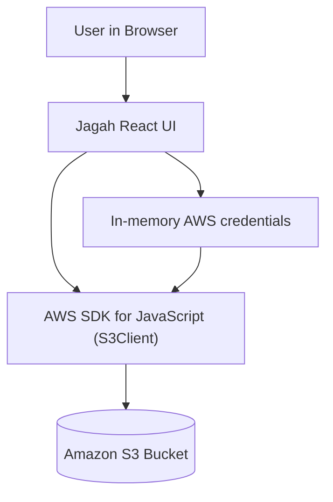
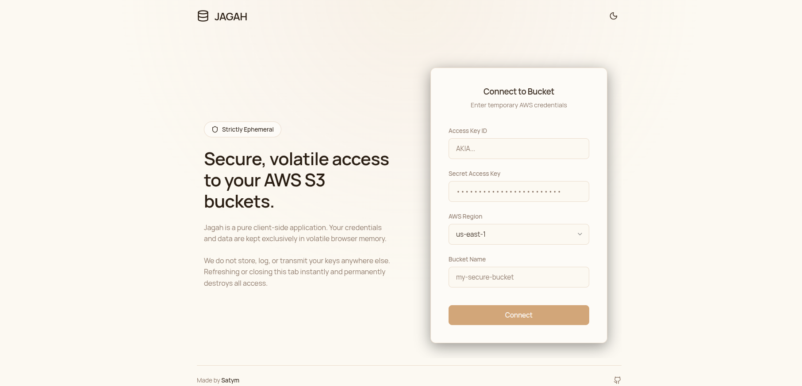

# jagah-s3

Jagah is a pure client-side S3 file explorer. It lets you connect to an AWS S3 bucket using temporary credentials and then browse folders, upload files, rename objects, and delete objects, all from your browser.

## 1. Secure Login

**Features:**
- **Strictly Ephemeral:** Your AWS credentials (Access Key ID, Secret Key, Region, Bucket Name) are kept exclusively in volatile browser memory.
- **No Backend:** We do not store, log, or transmit your keys anywhere except directly to AWS. Refreshing or closing the tab instantly destroys all access.
- **Premium UI:** Warm, skinnish light-mode tone with billion-dollar B2B SaaS aesthetic components.

## 2. Bucket Explorer

**Features:**
- **List-Wise View:** Clean, professional data table displaying file names, upload dates, and exact file sizes.
- **Breadcrumb Navigation:** Navigate seamlessly through S3 folder structures.
- **Quick Actions:** One-click capabilities to Download (via secure presigned URLs), Rename (via copy & delete), and Delete files.
- **Live Refresh & Upload:** Dedicated actions to quickly fetch the latest bucket status or upload new files directly to the current prefix.

## How it works

- You enter AWS access key, secret key, region, and bucket name in the UI.
- The app stores credentials only in React state (volatile memory).
- A client-side `S3Client` is created from the AWS SDK.
- The explorer uses S3 APIs (`ListObjectsV2`, `PutObject`, `CopyObject`, `DeleteObject`) to manage objects.
- Closing or refreshing the tab clears the session and credentials.

## Run locally

```bash
npm install
npm run dev
```

## Security notes

- This app has no backend and does not store credentials anywhere.
- Use temporary or scoped credentials (IAM roles or STS) whenever possible.
- Treat browser refresh or tab close as a full logout.
