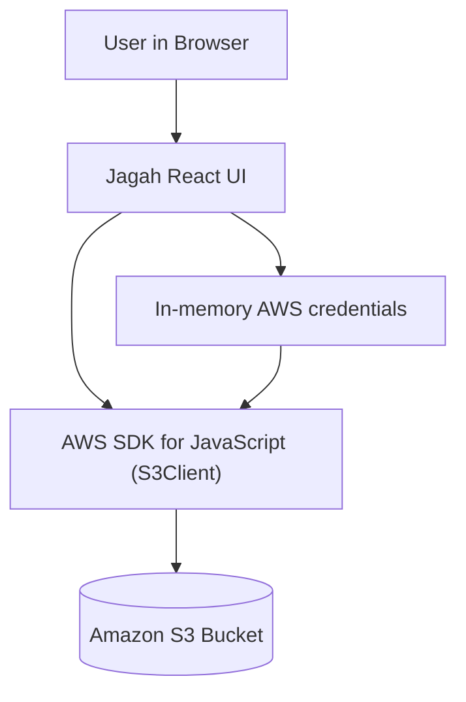

# jagah-s3

Jagah is a pure client-side S3 file explorer. It lets you connect to an AWS S3 bucket using temporary credentials and then browse folders, upload files, rename objects, and delete objects, all from your browser.

## What it does

- Connects to a single S3 bucket using user-provided credentials.
- Lists folders and files with a breadcrumb-style explorer.
- Uploads new files to the current prefix.
- Renames files by copying and deleting objects.
- Deletes files from the bucket.
- Keeps credentials only in browser memory (no backend).

## How it works

- You enter AWS access key, secret key, region, and bucket name in the UI.
- The app stores credentials only in React state (volatile memory).
- A client-side `S3Client` is created from the AWS SDK.
- The explorer uses S3 APIs (`ListObjectsV2`, `PutObject`, `CopyObject`, `DeleteObject`) to manage objects.
- Closing or refreshing the tab clears the session and credentials.

## Run locally

```bash
npm install
npm run dev
```

## Security notes

- This app has no backend and does not store credentials anywhere.
- Use temporary or scoped credentials (IAM roles or STS) whenever possible.
- Treat browser refresh or tab close as a full logout.
